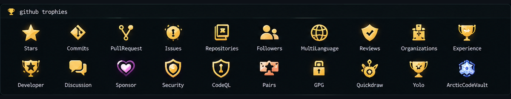

<div align="center">


# hey, i'm Rudi 👋


`e-commerce` · `automation` · `web` · `systems`

</div>

```js
const rudi = {
  role: "E-Commerce Specialist",
  focus: ["automation", "pricing systems", "internal tools"],
  currently: "turning repetitive work into systems",
  mood: "chill, but shipping."
};
```

### ~/currently-building

```text
├── marketplace-pricing-center
├── ecommerce-automation
├── personal-portfolio
└── blog-cms
```

### ~/workflow

```text
understand → simplify → automate → ship → improve
```

### 🏆 trophy.wall

<div align="center">

<br>
<sub>decorative wall for the profile aesthetic ✦ actual GitHub activity is shown below</sub>
</div>

### contribution.log

<div align="center">

<picture>
  <source media="(prefers-color-scheme: dark)" srcset="https://raw.githubusercontent.com/jieponk/jieponk/output/github-contribution-grid-snake-dark.svg">
  <source media="(prefers-color-scheme: light)" srcset="https://raw.githubusercontent.com/jieponk/jieponk/output/github-contribution-grid-snake.svg">
  
</picture>

```text
jieponk@github:~$ status

[✓] learning
[✓] building
[✓] breaking things
[✓] fixing them again
[→] still shipping...
```

</div>
